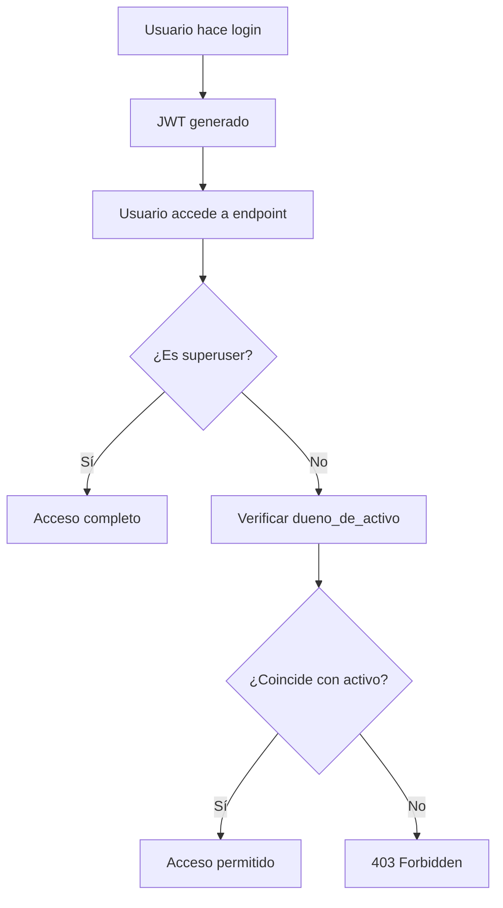

# Sistema de Permisos por Propietario - API_AUTH

## Resumen
El sistema implementa control de acceso basado en propietarios de activos (`DUEÑO_DE_ACTIVO`). Cada usuario puede únicamente ver y modificar los activos que pertenecen a su área/departamento asignado, excepto los administradores que tienen acceso completo.

## Arquitectura del Sistema

### Modelo de Usuario Actualizado
```python
class User(Base):
    id: Mapped[int] = mapped_column(Integer, primary_key=True, index=True)
    email: Mapped[str] = mapped_column(String, unique=True, index=True)
    username: Mapped[str] = mapped_column(String, unique=True, index=True)
    hashed_password: Mapped[str] = mapped_column(String, nullable=False)
    full_name: Mapped[Optional[str]] = mapped_column(String, nullable=True)
    dueno_de_activo: Mapped[Optional[str]] = mapped_column(String, nullable=True)  # NUEVO
    is_active: Mapped[bool] = mapped_column(Boolean, default=True)
    is_superuser: Mapped[bool] = mapped_column(Boolean, default=False)
```

### Tipos de Usuario

#### 1. Administrador (Superuser)
- **Campo**: `is_superuser = True`
- **Acceso**: Todos los activos sin restricción
- **Permisos**: Crear, leer, actualizar, eliminar cualquier activo
- **Identificación**: `dueno_de_activo = None`

#### 2. Usuario Regular
- **Campo**: `is_superuser = False`
- **Acceso**: Solo activos donde `DUEÑO_DE_ACTIVO` coincida con su `dueno_de_activo`
- **Permisos**: CRUD limitado a sus propios activos
- **Identificación**: `dueno_de_activo = "Nombre del área/departamento"`

## Funciones de Autorización

### `check_asset_ownership(current_user: User, asset_owner: str) -> bool`
Verifica si un usuario puede acceder a un activo específico:

```python
def check_asset_ownership(current_user: User, asset_owner: str) -> bool:
    # Superusers pueden acceder a todo
    if current_user.is_superuser:
        return True
    
    # Usuarios regulares solo a sus activos
    if current_user.dueno_de_activo is None:
        return False
        
    # Comparación normalizada (sin espacios extra)
    user_owner = current_user.dueno_de_activo.strip()
    asset_owner_clean = asset_owner.strip()
    
    return user_owner == asset_owner_clean
```

### `verify_asset_access(asset_owner: str, current_user: User) -> User`
Dependencia FastAPI que verifica acceso y lanza excepción 403 si no tiene permisos.

## Endpoints Modificados

### `GET /inventario/` - Listar Activos
**Antes**: Todos los activos para usuarios autenticados
**Ahora**: 
- **Admin**: Todos los activos
- **Usuario**: Solo activos de su `dueno_de_activo`

```python
# Filtrado implementado
if current_user.is_superuser:
    filtered_assets = all_assets  # Admin ve todo
else:
    user_owner = current_user.dueno_de_activo.strip()
    filtered_assets = [
        asset for asset in all_assets
        if asset.get(DUENO_DE_ACTIVO_FIELD, "").strip() == user_owner
    ]
```

### `GET /inventario/{activo_id}` - Obtener Activo
**Verificación**: Comprueba que el usuario pueda acceder al activo específico antes de devolverlo.

### `PUT /inventario/{activo_id}` - Actualizar Activo
**Verificaciones**:
1. Usuario puede acceder al activo actual
2. Si cambia propietario, usuario puede asignar al nuevo propietario

### `DELETE /inventario/{activo_id}` - Eliminar Activo
**Verificación**: Usuario debe poder acceder al activo para eliminarlo.

### `GET /inventario/owners` - Endpoint Público
**Sin cambios**: Permanece público, no requiere autenticación.

## Usuarios y Credenciales

### Usuarios Generados Automáticamente
El sistema incluye 27 usuarios basados en la lista de propietarios reales:

#### Administrador
- **Email**: `admin@inventario.gov.co`
- **Username**: `admin`
- **Password**: `admin123`
- **Acceso**: Todos los activos

#### Usuarios por Propietario (26 usuarios)
Ejemplos:
- **Jefe Oficina de Control Interno**
  - Email: `jefe_oficina_de_control_interno@inventario.gov.co`
  - Username: `jefe_oficina_de_control_interno`
  - Password: `password123`

- **Subdirección Financiera y Administrativa**
  - Email: `subdireccion_financiera_y_administrativa@inventario.gov.co`
  - Username: `subdireccion_financiera_y_administrativa`
  - Password: `password123`

### Generación de Credenciales
```bash
# Generar credenciales sin base de datos
python scripts/generate_credentials.py

# Archivos generados:
# - credentials/user_credentials_YYYYMMDD_HHMMSS.json
# - credentials/user_credentials_YYYYMMDD_HHMMSS.txt
# - credentials/user_credentials_YYYYMMDD_HHMMSS.csv
```

### Pruebas del Sistema
```bash
# Probar autenticación y permisos
python scripts/test_credentials.py
```

## Flujo de Autenticación y Autorización



## Casos de Uso

### Escenario 1: Admin accede a cualquier activo
```python
# Admin puede ver activos de cualquier propietario
admin_user.is_superuser = True
check_asset_ownership(admin_user, "Cualquier Propietario")  # True
```

### Escenario 2: Usuario accede a su activo
```python
# Usuario solo puede ver sus propios activos
user.dueno_de_activo = "Oficina de Control Interno"
asset_owner = "Oficina de Control Interno"
check_asset_ownership(user, asset_owner)  # True
```

### Escenario 3: Usuario intenta acceder a activo ajeno
```python
# Usuario NO puede ver activos de otros
user.dueno_de_activo = "Oficina de Control Interno"
asset_owner = "Subdirección Financiera"
check_asset_ownership(user, asset_owner)  # False -> 403 Forbidden
```

## Configuración de Base de Datos

### Para Desarrollo Local
```bash
# Crear usuarios en base de datos (requiere PostgreSQL)
python scripts/create_users.py
```

### Para Producción en Railway
1. Los usuarios se crean automáticamente en el primer despliegue
2. Usar variables de entorno para credenciales de admin
3. Cambiar contraseñas por defecto

## Seguridad

### Medidas Implementadas
1. **Verificación a nivel de endpoint**: Cada operación CRUD verifica permisos
2. **Filtrado de datos**: Los usuarios solo ven datos permitidos
3. **Normalización de strings**: Previene errores por espacios extra
4. **Validación de propietario**: Impide cambiar propietario sin permisos

### Consideraciones de Producción
1. **Cambiar contraseñas**: Todas las contraseñas por defecto (`admin123`, `password123`)
2. **Rotación de JWT**: Implementar refresh tokens
3. **Rate limiting**: Limitar intentos de login
4. **Logging**: Registrar intentos de acceso no autorizado
5. **Encriptación**: Usar HTTPS en producción

## API Responses

### Éxito (200/201)
```json
{
  "id": 1,
  "DUEÑO_DE_ACTIVO": "Oficina de Control Interno",
  "other_fields": "..."
}
```

### Sin permisos (403)
```json
{
  "detail": "No tienes permisos para acceder a este activo"
}
```

### No encontrado (404)
```json
{
  "detail": "Inventory asset not found"
}
```

## Mantenimiento

### Agregar Nuevo Usuario
1. Agregar propietario a la lista en `generate_credentials.py`
2. Ejecutar script de generación
3. Crear usuario en base de datos con script de inserción

### Modificar Permisos
1. Actualizar función `check_asset_ownership()`
2. Probar con script de tests
3. Actualizar documentación

### Monitoreo
- Revisar logs de acceso 403 Forbidden
- Monitorear intentos de login fallidos
- Verificar integridad de datos de propietarios